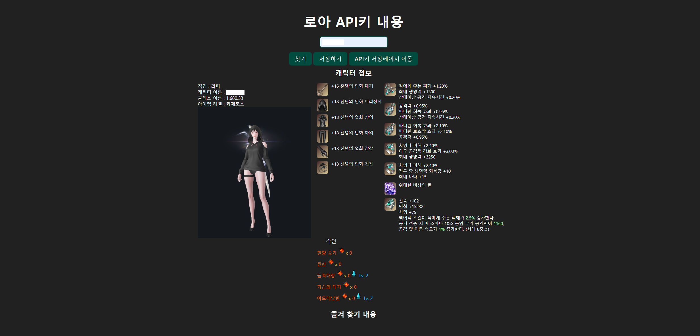

# 로스트아크 캐릭터 정보 출력 프로그램

## 목차
    1.캐릭터 정보 API키 가져오기  
    2.
    3.
    4.


### 캐릭터 정보 API키 가져오기

로스트아크 공식 API키 문서에는 캐릭터 이름, 해당 API key를 발급받아야한다.<br>
API 구조에서 요구하는 조건이 다음과 같다.

```
curl -X 'GET' 'https://developer-lostark.game.onstove.com/armories/characters/coolguy/profiles'
-H 'accept: application/json'
-H 'authorization: bearer your_JWT'
```

형태이다. GET 요청을할때 header에  "accept: application/json" 와 <br>
권한이 필요한데 "bearer your_JWT"는 bearer 다음 api키를 넣어야한다.

그래서 api키 가지고와서 캐릭터 정보를 출력해주는 프로그램을 만들어봤다.

### 예시 이미지는 다음과같다.<br>


<br>
동작전 메인 페이지 이고, api 키를 등록하러가면된다.<br>


### 해당 api키 등록 페이지이다.
<br>


<br>
API키를 저장하기를 누른뒤 뒤로가기를 클릭하고 <br>
캐릭터 이름을 넣고 찾기를 누르면 해당 캐릭터 정보들이 나온다.<br>
<h3>하나의 예시이다)</h3>



<br>
<br>
이처럼 캐릭터 정보를 보여준다.<br>
계속해서 업데이트를 나갈것이며, 해당 페이지를 제작후에 배포까지 해볼예정이다. <br>
지금은 DB랑 연결안시켜서 웹페이지 상에 api키가 남겨지지만 그걸 없앨예정이다.